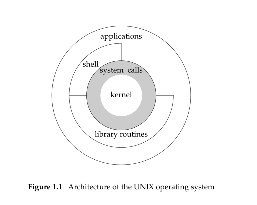

# Architecture of [computing system](https://en.wikipedia.org/wiki/Computing)

本章所要探讨的是architecture of [computing system](https://en.wikipedia.org/wiki/Computing)，而不是寻常所说的[computer architecture](https://en.wikipedia.org/wiki/Computer_architecture)，一般[computer architecture](https://en.wikipedia.org/wiki/Computer_architecture)所指的是诸如[Von Neumann architecture](https://en.wikipedia.org/wiki/Von_Neumann_architecture)、[Harvard architecture](https://en.wikipedia.org/wiki/Harvard_architecture)等描述computer硬件的架构。本节所要描述的内容是从一个更加高的角度来看待[computing system](https://en.wikipedia.org/wiki/Computing) ，包括最底层的hardware，operating system，application software。

正如[Computer hardware](https://en.wikipedia.org/wiki/Computer_hardware)中所描述的：

> The progression from levels of "hardness" to "softness" in [computer systems](https://en.wikipedia.org/wiki/Computer_system) parallels a progression of [layers of abstraction](https://en.wikipedia.org/wiki/Abstraction_layer) in computing.
>
> A combination of **hardware** and **software** forms a usable [computing](https://en.wikipedia.org/wiki/Computing) system.

现代 [computing system](https://en.wikipedia.org/wiki/Computing) 的整体架构的发展是受到计算机科学领域的[layers of abstraction](https://en.wikipedia.org/wiki/Abstraction_layer)思想（分层思想）的影响的，一个[computing system](https://en.wikipedia.org/wiki/Computing) 可以认为由两层构成：

- **software**
- **hardware**

[Instruction set](https://en.wikipedia.org/wiki/Instruction_set_architecture)是software和hardware之间的接口。

现代[computing system](https://en.wikipedia.org/wiki/Computing) 的运行是离不开operating system的，operating system所属的是software这一层，下面对operating system来进行更加精细的分层。

## Architecture of operating system

在[Operating system](https://en.wikipedia.org/wiki/Operating_system)中给出了一个典型的operating system的architecture如下：

| Operating systems                                            |
| ------------------------------------------------------------ |
|  |

上图中User表示的是用户，不属于OS中，后面的讨论会将其忽视。

在[Advanced Programming in the UNIX® Environment, Third Edition](http://www.apuebook.com/toc3e.html)的1.2 UNIX Architecture节中给出了Architecture of the UNIX operating system，如下：

上述两个架构图都大体展示OS的architecture，两者都各有利弊，图一包含了hardware，但是忽视了各层之间的interface。图二则正好相反。所以将两者结合起来则正好，后面会按照图二中的表示方式，将interface也看做是一层。充当interface的layer作为它的上下两层之间的interface。

| upper layer |                            layer                             |   role    |
| ----------- | :----------------------------------------------------------: | :-------: |
| software    |                         application                          |           |
|             | [system calls](https://en.wikipedia.org/wiki/System_call)&library routines | interface |
|             |  [kernel](https://en.wikipedia.org/wiki/Kernel_(computing))  |           |
|             | [Instruction set](https://en.wikipedia.org/wiki/Instruction_set_architecture) | interface |
| hardware    | [hardware](https://en.wikipedia.org/wiki/Computer_hardware)  |           |

上述表格，在后面会进行不断地丰富和扩充，在下面章节中会包含对它的扩充和对应的图形展示: 

- `Kernel\Kernel.md#Monolithic kernel`章节

- `Kernel\Architecture.md#Kernel space and user space`章节
- `Operating-system\index.md#Concrete OS structure`章节

## 通过architecture来分析OS的作用

通过上述的OS的architecture，我们能够更加深刻地了解OS的作用了，下面是摘抄自[Understanding.The.Linux.kernel.3rd.Edition](https://www.oreilly.com/library/view/understanding-the-linux/0596005652/)的Chapter 1.4. Basic Operating System Concepts中关于OS的作用的描述：

The operating system must fulfill two main objectives:

1) Interact with the **hardware** components, servicing all low-level programmable elements included in the hardware platform.

2) Provide an **execution environment** to the applications that run on the computer system (the so-called user programs).

这两个objective（其实就是OS的作用、使命）相当于两条线，后面我们将沿着这两条线深入对linux OS的学习。

我们可以进一步简化：OS管理着hardware和process，它作为两者之间的桥梁。

## 总结

上面我使用了**层次化的结构**来描述[computing system](https://en.wikipedia.org/wiki/Computing)的架构，至此，已经建立了operating system的整体architecture（model）。