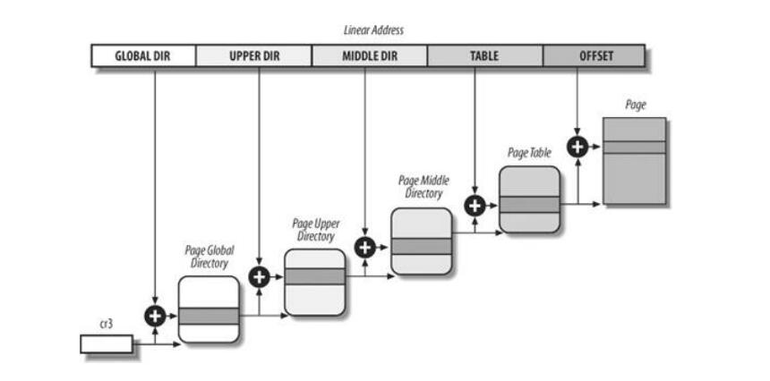

[TOC]

# 2.5. Paging in Linux

Linux adopts a common **paging model** that fits both 32-bit and 64-bit architectures. As explained in the earlier section "Paging for 64-bit Architectures," two paging levels are sufficient for 32-bit architectures, while 64-bit architectures require a higher number of paging levels. Up to version 2.6.10, the Linux paging model consisted of **three paging levels**. Starting with version 2.6.11, a **four-level paging model** has been adopted. [`*`] The four types of page tables illustrated in Figure 2-12 are called:

> [`*`] This change has been made to fully support the linear address bit splitting used by the x86_64 platform (see Table 2-4).

- Page Global Directory
- Page Upper Directory
- Page Middle Directory
- Page Table

Figure 2-12. The Linux paging model

The **Page Global Directory** includes the addresses of several **Page Upper Directories**, which in turn include the addresses of several **Page Middle Directories**, which in turn include the addresses of several **Page Tables**. Each Page Table **entry** points to a **page frame**. Thus the linear address can be split into up to five parts. Figure 2-12 does not show the bit numbers, because the size of each part depends on the computer architecture.

For 32-bit architectures with no **Physical Address Extension**, two paging levels are sufficient. Linux essentially eliminates the **Page Upper Directory** and the **Page Middle Directory** fields by saying that they contain zero bits. However, the positions of the **Page Upper Directory** and the **Page Middle Directory** in the sequence of pointers are kept so that the same code can work on 32-bit and 64-bit architectures. The kernel keeps a position for the **Page Upper Directory** and the **Page Middle Directory** by setting the number of entries in them to 1 and mapping these two entries into the proper entry of the **Page Global Directory**.

Finally, for 64-bit architectures three or four levels of paging are used depending on the linear address bit splitting performed by the hardware (see Table 2-2).

Linux's handling of processes relies heavily on **paging**. In fact, the automatic translation of **linear addresses** into **physical** ones makes the following design objectives feasible:

- Assign a different **physical address space** to each process, ensuring an efficient protection against addressing errors.
- Distinguish pages (groups of data) from page frames (physical addresses in main memory). This allows the same page to be stored in a page frame, then saved to disk and later reloaded in a different page frame. This is the basic ingredient of the virtual memory mechanism (see Chapter 17).

In the remaining part of this chapter, we will refer for the sake of concreteness to the paging circuitry used by the 80 x 86 processors.

As we will see in Chapter 9, each process has its own **Page Global Directory** and its own set of **Page Tables**. When a process switch occurs (see the section "Process Switch" in Chapter 3), Linux saves the  `cr3` control register in the descriptor of the process previously in execution and then loads  `cr3` with the value stored in the descriptor of the process to be executed next. Thus, when the new process resumes its execution on the CPU, the **paging unit** refers to the correct set of **Page Tables**.

Mapping linear to physical addresses now becomes a mechanical task, although it is still somewhat complex. The next few sections of this chapter are a rather tedious list of functions and macros that retrieve information the kernel needs to find addresses and manage the tables; most of the functions are one or two lines long. You may want to only skim these sections now, but it is useful to know the role of these functions and macros, because you'll see them often in discussions throughout this book.

## 2.5.1. The Linear Address Fields

The following macros simplify **Page Table** handling: