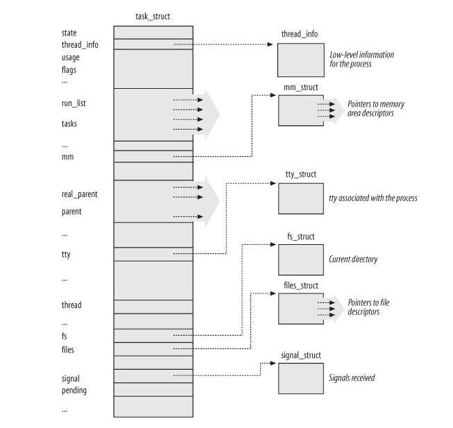

# 3.2. Process Descriptor

To manage processes, the kernel must have a clear picture of what each process is doing. It must
know, for instance, the process's priority（调度的优先级）, whether it is running on a CPU or blocked on an event, what **address space** has been assigned to it, which files it is allowed to address, and so on. This is
the role of the *process descriptor* a  `task_struct` type structure whose fields contain all the
information related to **a single process**. [`*`] As the repository of so much information, the **process
descriptor** is rather complex. In addition to a large number of fields containing process attributes,
the process descriptor contains several pointers to other data structures that, in turn, contain
pointers to other structures. Figure 3-1 describes the Linux process descriptor schematically（按照图式）.

> [`*`] The kernel also defines the  `task_t` data type to be equivalent to  `struct task_struct` 

> NOTE :  `task_struct` 的源代码参见：
>
> - https://elixir.bootlin.com/linux/latest/ident/task_struct
> - https://github.com/torvalds/linux/blob/master/include/linux/sched.h
> 
> 关于`task_struct`和process，thread之间的对应关系，在Chapter 3. Processes中进行了细致的分析；此处不再赘述；

The six data structures on the right side of the figure refer to specific resources owned by the
process. Most of these resources will be covered in future chapters. This chapter focuses on two
types of fields that refer to the **process state** and to **process parent/child relationships**.

Figure 3-1. The Linux process descriptor




## 3.2.1. Process State

As its name implies, the  `state` field of the process descriptor describes what is currently happening
to the process. It consists of an array of flags, each of which describes a possible process state. In
the current Linux version, these states are mutually exclusive, and hence exactly one flag of  `state`
always is set; the remaining flags are cleared. The following are the possible process states:

### `TASK_RUNNING`

The process is either executing on a CPU or waiting to be executed.

### `TASK_INTERRUPTIBLE`

The process is suspended (**sleeping**) until some condition becomes true. Raising a hardware interrupt, releasing a system resource the process is waiting for, or delivering a signal are examples of conditions that might wake up the process (put its `state` back to  `TASK_RUNNING` ).

> NOTE ： **sleeping**相当于suspended

### `TASK_UNINTERRUPTIBLE`

Like  `TASK_INTERRUPTIBLE` , except that delivering a signal to the sleeping process leaves its state unchanged. This process state is seldom used. It is valuable, however, under certain specific conditions in which a process must wait until a given event occurs without being interrupted. For instance, this state may be used when a process opens a **device file** and the corresponding **device driver** starts probing for a corresponding **hardware device**. The **device driver** must not be interrupted until the probing is complete, or the **hardware device** could be left in an unpredictable state.

### `TASK_STOPPED`

Process execution has been stopped; the process enters this state after receiving a  [`SIGSTOP`](http://man7.org/linux/man-pages/man7/signal.7.html) , `SIGTSTP` ,  `SIGTTIN` , or  `SIGTTOU` signal.

### `TASK_TRACED`

Process execution has been stopped by a debugger. When a process is being monitored by another (such as when a debugger executes a  [`ptrace( )`](http://man7.org/linux/man-pages/man2/ptrace.2.html) system call to monitor a test program), each signal may put the process in the  `TASK_TRACED` state.


Two additional states of the process can be stored both in the  `state` field and in the  `exit_state` field
of the process descriptor; as the field name suggests, a process reaches one of these two states only
when its execution is terminated:

### `EXIT_ZOMBIE`

Process execution is terminated, but the parent process has not yet issued a  [wait4( )](http://man7.org/linux/man-pages/man2/wait4.2.html) or [waitpid( )](http://man7.org/linux/man-pages/man2/waitpid.2.html) system call to return information about the dead process. `[*]` Before the  wait( )-like call is issued, the kernel cannot discard the data contained in the dead process descriptor because the parent might need it. (See the section "Process Removal" near the end of this chapter.)

> `[*]` There are other  wait( )-like library functions, such as  [wait3( )](http://man7.org/linux/man-pages/man2/wait4.2.html) and  [wait( )](http://man7.org/linux/man-pages/man2/waitpid.2.html) , but in Linux they are
> implemented by means of the  wait4( ) and  waitpid( ) system calls.

### `EXIT_DEAD`

The final state: the process is being removed by the system because the parent process has just issued a  [wait4( )](http://man7.org/linux/man-pages/man2/wait4.2.html)  or [waitpid( )](http://man7.org/linux/man-pages/man2/waitpid.2.html)  system call for it. Changing its state from  `EXIT_ZOMBIE` to `EXIT_DEAD` avoids **race conditions** due to other threads of execution that execute  `wait( )` -like calls on the same process (see Chapter 5).

The value of the  `state` field is usually set with a simple assignment. For instance:

```c
p->state = TASK_RUNNING;
```


The kernel also uses the  `set_task_state` and  `set_current_state` macros: they set the state of a
specified process and of the process currently executed, respectively. Moreover, these macros
ensure that the assignment operation is not mixed with other instructions by the compiler or the
**CPU control unit**. Mixing the instruction order may sometimes lead to catastrophic results (see
Chapter 5).

> NOTE: process state 补充内容：
>
> - https://lwn.net/Articles/288056/

